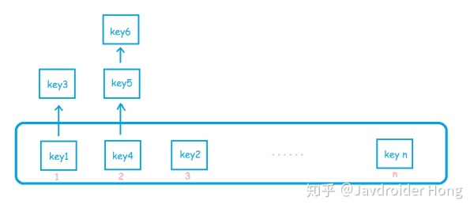

Redis是啥？用Redis官方的话来说就是：

> Redis is an open source (BSD licensed), in-memory data structure store, used as a database, cache and message broker.

	
	Redis是一个开源的、**基于内存**的**数据结构存储器**，可以用作**数据库**、**缓存**和**消息中间件**。
	What??? 这玩意把数据放在内存，还想当数据库使？为什么是“data structure store”，而不是“data store”？还能用作消息中间件？？你这么牛，你咋不上天？
	是的，Redis就是这么牛 (￣▽￣)~*
	我们只需从Redis最常用的功能——缓存，开始了解，上面那些问题也就迎刃而解了。
	如果你是Redis新手，或者此前从未接触过Redis，那么这篇文章不仅能帮你快速了解Redis的实现原理，还能帮你了解一些架构设计的艺术；如果你是Redis老司机，那么，希望这篇文章能带给你一些新的东西。
	**你会怎样实现一个缓存？**
	假设让你设计一个缓存，你会怎么做？
	相信大家都会想到用**Map**来实现，就像这样：
	

``` javascript
// get value from cache
String value = map.get("someKey");
if(null == value) {
 // get value from DataBase
 value = queryValueFromDB("someKey");
}
```

	那用什么Map呢？HashMap、TreeMap这些都线程不安全，那就用HashTable或者ConcurrentHashMap好了。
	**不管你用什么样的Map，它的背后都是key-value的Hash表结构，目的就是为了实现O(1)复杂度的查找算法**，Redis也是这样实现的，另一个常用的缓存框架Memcached也是。
	Hash表的数据结构是怎样的呢？相信很多人都知道，这里简单画个图：


	简单说，Hash表就是一个数组，而这个数组的元素，是一个链表。
	为什么元素是链表？理论上，如果我们的数组可以做成无限大，那么每来一个key，我们都可以把它放到一个新的位置。但是这样很明显不可行，数组越大，占用的内存就越大。
	所以我们需要限制数组的大小，假设是16，那么计算出key的hash值后，对16取模，得出一个0~15的数，然后放到数组对应的位置上去。
	好，现在key1放到index为2的位置，突然又来了一个key9，刚好他也要放到index为2的位置，那咋办，总不能把人家key1给踢掉吧？所以key1的信息必须存储在一个链表结构里面，这样key9来了之后，只需要把key1所在的链表节点的next，指向key9的链表节点即可。
	这样就没问题了吗？想象一下，如果链表越来越长，会有什么问题？
	很明显，链表越长，Hash表的查询、插入、删除等操作的性能都会下降，极端情况下，如果全部元素都放到了一个链表里头，复杂度就会降为O(n)，也就和顺序查找算法无异了。（正因如此，Java8里头的HashMap在元素增长到一定程度时会从链表转成一颗红黑树，来减缓查找性能的下降）
	怎么解决？rehash。
	关于rehash，这里就不细讲了，大家可以先了解一下Java HashMap的resize函数，然后再通过这篇文章：A little internal on redis key value storage implementation 去了解Redis的rehash算法，你会惊讶的发现Redis里头居然是两个HashTable。
	好，上面带大家从一个及其微观的角度窥视了Redis，下面几个小节，再带大家用宏观的视角去观察Redis。
	C/S架构
	作为Redis用户，我们要怎样把数据放到上面提到的Hash表里呢？
	我们可以通过Redis的命令行，当然也可以通过各种语言的Redis API，在代码里面对Hash表进行操作，这些都是Redis客户端（Client），而Hash表所在的是Redis服务端（Server），也就是说Redis其实是一个C/S架构。
	显然，Client和Server可以是在一台机器上的，也可以不在：

欢迎使用 **{小书匠}(xiaoshujiang)编辑器**，您可以通过 `小书匠主按钮>模板` 里的模板管理来改变新建文章的内容。